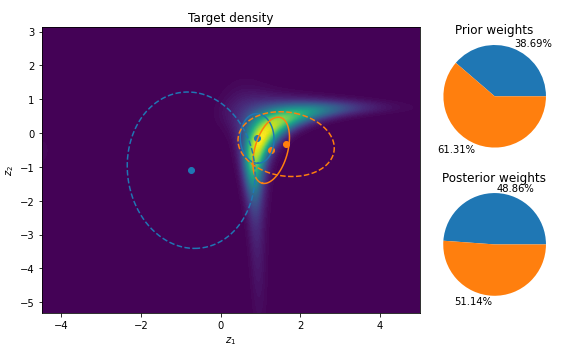

# Utilities for Learning with Finite Gaussian Mixture Models

## What is this?
This is a Tensorflow 2.0 implementation of some utilties for learning with Gaussian Mixture Models.



## Getting Started
Clone this repository and run
```
pip install . 
```
from the source directory.

To check everything works fine, you can run the tests in ```./gmm_util/tests```.

## Notes
This code is still in development and thus not thoroughly tested. Features may change in the future. It was tested with the packages listed in ```./setup.cfg```.

## License
This code is licensed under the MIT license and is free to use by anyone without any restrictions.

